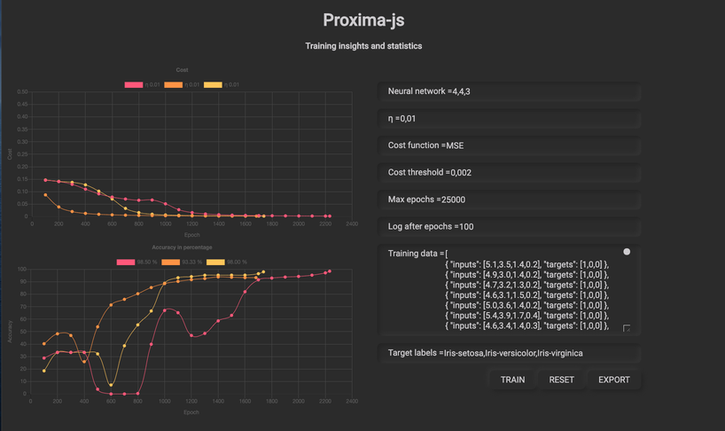

# Proxima
Proxima is a **fully connected neural network** micro library written in javascript for browsers and nodejs.
  
_Support Proxima development by donating or becoming a sponsor._   
[](https://www.paypal.com/cgi-bin/webscr?cmd=_donations&business=878QVT5YLAQC2&currency_code=EUR&source=url)
[](https://liberapay.com/wdrap/donate)
 
## Installation
```
npm install proxima-js --save
```
## Usage
```javascript
var Proxima = require('proxima-js') // only for nodejs

var xor_training_data = [
    {inputs: [0, 1], targets: [1]},
    {inputs: [1, 0], targets: [1]},
    {inputs: [0, 0], targets: [0]},
    {inputs: [1, 1], targets: [0]}
]

var hyperParameters = {
    neural_network: [2,3,1],
    learning_rate: 0.5,
    cost_function: 'SE',
    cost_threshold: 0.005,
    epoch_limit: 15000,
    log_after_x_epochs: 0,
}

var p = new Proxima(hyperParameters)
p.train(xor_training_data)
console.log(p.predict([0,1]))
console.log(p.predict([1,0]))
console.log(p.predict([0,0]))
console.log(p.predict([1,1]))
```
The above program will print something like this to the console where
```
training: 32.45ms error: 0.004967480795865376 iterations: 1301
training: 37.64ms
{
  outputs: [ 0.9005459992237329 ],
  flattened: [ 1 ],
  labeled: [ true ]
}
{
  outputs: [ 0.9001820903943029 ],
  flattened: [ 1 ],
  labeled: [ true ]
}
{
  outputs: [ 0.09853230880766463 ],
  flattened: [ 0 ],
  labeled: [ false ]
}
{
  outputs: [ 0.0997429169712241 ],
  flattened: [ 0 ],
  labeled: [ false ]
}
```
The `predict()` method returns an object with the following properties:
- outputs: An array with the actual output of each node in the neural network .
- flattened: An array with the rounded output values for each node, only when within the threshold of the neural network error.
- labeled: An array of labels if passed in the `train()` method, otherwise the flattened result converted to a boolean. 

You can also train your network with the '**training and insights**' project from the examples-web folder



### Configuration options
```javascript
var hyperParameters = {
    neural_network: [2,3,1],    // 3 layered neural network with 1 input layer with 2 nodes, 1 hidden layer with 3 nodes and 1 output layer with 1 node
    learning_rate: 0.5,         // η Defaults to 0.5
    cost_function: 'SE',        // Default 'SE' squared error other possible values are MSE, RMS and SSE
    cost_threshold: 0.005,      // Stops training when the result of the cost/loss function is less, defaults to 0.05  
    epoch_limit: 15000,         // Maximum training iterations if the cost_threshold in not reached
    log_after_x_epochs: 0,      // Outputs the error after x iterations, 0 means no output
}
```
### Export/import the neural network state
After the neural network has completed training you can use `export()` to get the neural network state in json format 
and `import()` to load the neural network state back in. This is convenient, so you don't have to train the network 
every time or even perform training on another machine.

## Methods
`#train(data)`

data must be an array of objects `{inputs: [0, 1], targets: [1]} `.

`#predict()`

returns an object with where:
- output: is the neural network actual output
- flatten: is each output rounded to the nearest integer using the network error as a threshold

# What's behind Proxima
## Activation functions
- Sigmoid (default)
- Tanh (todo)
- ReLu (todo)
- Leaky ReLu (todo)
- Swish (todo)

## Cost functions
- Squared Error (default)
- Mean Squared Error (todo)
- Root Mean Square (todo)
- The Sum of Square Errors (todo)

## Gradient descent methods
- Stochastic gradient descent (default)
- Mini-batch gradient descent (todo)
- Batch gradient descent (todo)

## Gradient descent optimization algorithms
- Regular gradient descent (default)
- Momentum based gradient descent (todo)             
- Implement other gradient descent optimization algorithms (todo)
 
#Machine learing terminology (wip)
## training data
Each row is an sample aka example, instance, record, observation
Each column is an _feature_ aka _predictor_, _attribute_, _independent variable_, _input_, _regressor_

## neural network output
The value we are predicting is the response aka target, outcome, label, dependent variable

#Supervised learning

## Classification
the response is categorical, a finite set of values
## Regression
the response is ordered and continuous